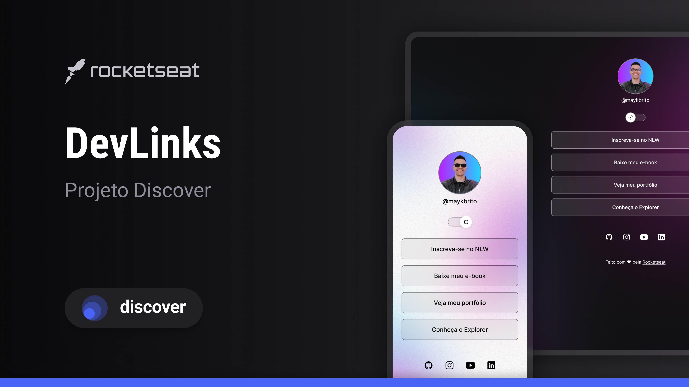

<h1 align="center"> DevLinks </h1>

 Projeto de Links para redes sociais, desenvolvido por min junto a Rocketseat, no seu programa Discover gratuito, o qual apresentou alguns conceitos básicos de HTML, CSS e JavaScript. 

  

## 🚀 Tecnologias
Esse projeto foi desenvolvido com as seguintes tecnologias:

- HTML e CSS
- JavaScript
- Git e Github
- Figma

## 💻 Projeto
O DevLinks é um agregador de links para usar cono cartão de visita online.

## ✨ Layout 
Você pode vsualizar o layout do projeto através [desse Link](https://www.figma.com/design/P4Y8OwXFwAQSR4P1cVRGvr/DevLinks-%E2%80%A2-Projeto-Discover-(Community)?node-id=1437-191&t=IsHs1Ev0zw4PflPJ-1/duplicate). É necessário ter conta no [Figma](https://figma.com) para acessá-lo.

---
 
Feito com 💜 by Rocketseat [participe da comunidade!](https://discord.gg/rocketseat)